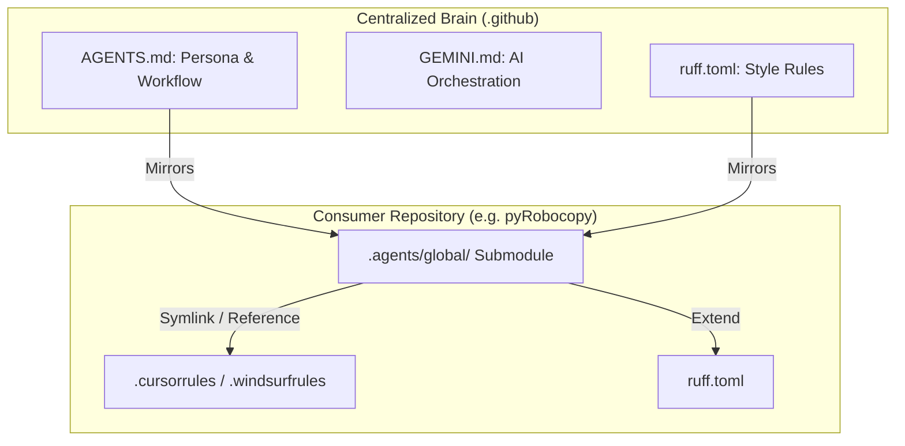

# 🧠 MCRE-BE Organizational Brain

Welcome to the centralized brain and standard configuration repository for the **MCRE-BE** organization. This repository hosts global settings, AI instructions, CI/CD templates, and engineering standards enforced across all organization codebases.

---

## 🏛️ Architecture & Integration Flow

Our development environments utilize git submodules to bridge individual workspaces with this centralized brain, feeding uniform configurations directly to local AI agents and linters.

---

## 📂 Repository Layout

- **`AGENTS.md`**: Persona, engineering discipline, and the core workflow state-machine for IDE agents.
- **`GEMINI.md`**: Specialized guidelines and orchestrations designed specifically for Gemini agent models.
- **`skills/`**: A library of modular, token-saving engineering skills loaded dynamically by agents as needed.
- **`scripts/verify.py`**: Programmatic verification pipeline run by agents locally before completing tasks.
- **`ruff.toml`**: Shared styling rules and import sorting conventions.

---

## 🚀 Workspace Setup

To bootstrap a new or existing repository under the MCRE-BE umbrella to consume this centralized brain, follow the step-by-step instructions in the:

👉 **[AI Agent Workspace Setup Guide (SETUP.md)](SETUP.md)**

---

## 📦 Active Consumer Repositories

This brain coordinates and enforces standards across the following repositories:
1. **`dll-danda-ibp-scripts`**: Monorepo orchestrating ETL, IBPM, and Argos synchronization.
2. **`pyRobocopy`**: Premium Windows-specific Robocopy wrapper.
3. **`ntfy_lite`**: Minimalist Python API and CLI for ntfy.sh notifications.
4. **`becse-adp-dllgsc`**: Databricks ADP data product utilizing dbt and SQL.
